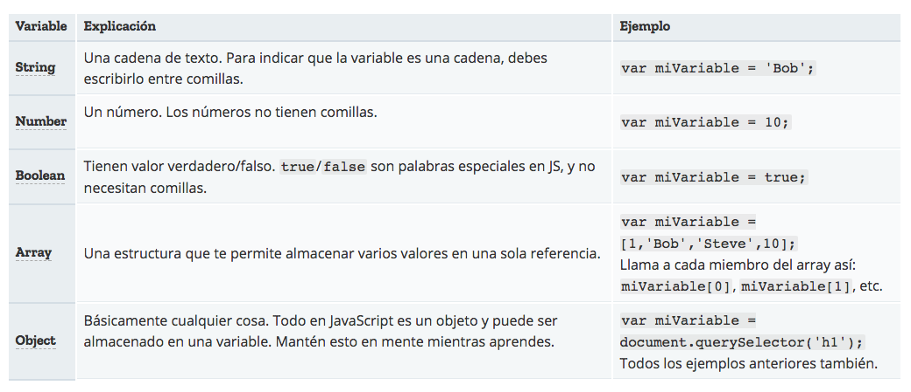
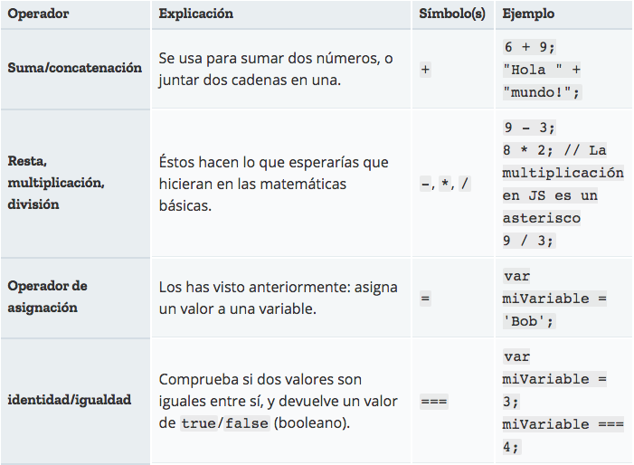

## Curso de <span style="color: #e49436">javascript</span>
### Introducción a javascript
#### <span style="color: #e49436">Dictado por:</span>
##### Prof. Erick Agrazal

---

¿Qué es Javascript?
-------------------

- Es un lenguage de programación <span style="color: #e49436">Robusto</span>.
- Es un lenguage orientado a objetos y eventos.
- Inventado por: <span style="color: #e49436">Brendan Eich</span>.
- En estos momentos, esta presente en <span style="color: #e49436">todas partes</span>.

---

A lo nuestro
------------

### ¡Hola mundo!

---

Variables (Definición)
----------------------

- Todas las líneas deben terminar en punto y coma.
- Las variables pueden tener <span style="color: #e49436">casi</span> cualquier nombre.
- Sensibles entre mayúsculas/minúsculas.

```js
var nombreDeLaVariable;
```

---

Variables (Asignación)
----------------------

```js
// Asignaciones regulares
nombreDeLaVariable = 'Hola mundo';
var nombreDeLaVariable = 'Hola mundo';

// Reescritura del contenido de la variable
var nombreDeLaVariable = 'Bob';
nombreDeLaVariable = 'Steve';
```
---

Variables (Lectura)
-------------------

```js
// Simplemente se accede al nombre de la variable.
nombreDeLaVariable;

// Un ejemplo adelantado de impresión
console.log(nombreDeLaVariable);
```
---

Variables (Tipos de datos)
--------------------------



---

Comentarios
-----------

```js
// Tipo #1:
// Esto es un comentario

// Tipo #2:
/*
Esto es un comentario
de varias líneas.
*/
```
---

Operadores
----------



--- 

Operadores
----------


---

Operadores
----------

[¡Ver más operadores...!](https://developer.mozilla.org/es/docs/Web/JavaScript/Referencia/Operadores)