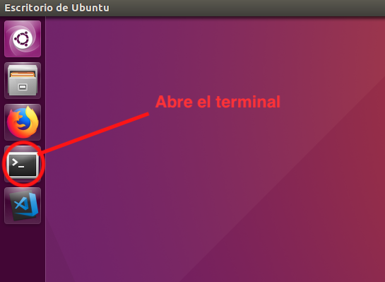
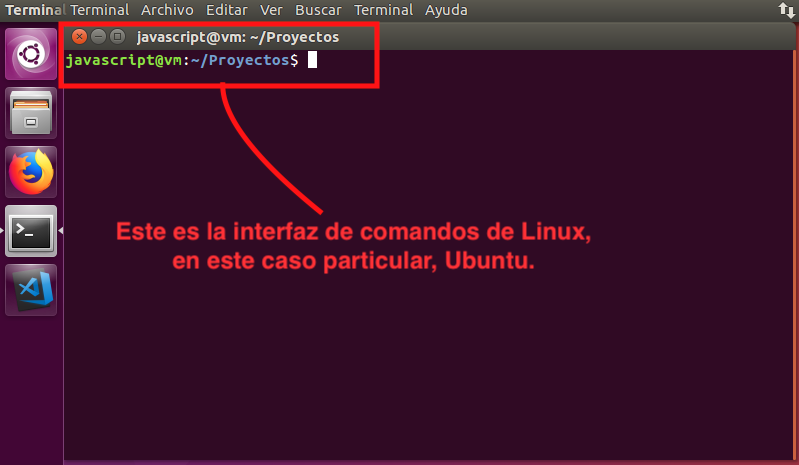
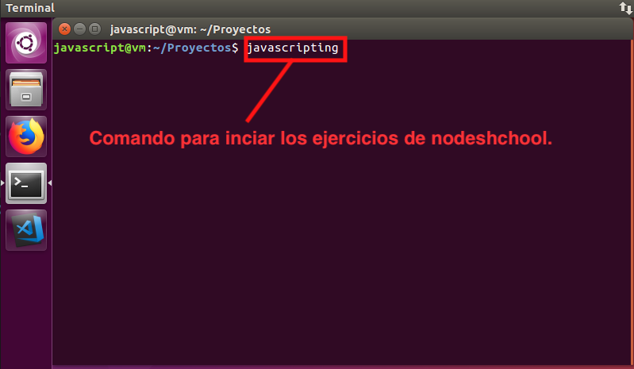
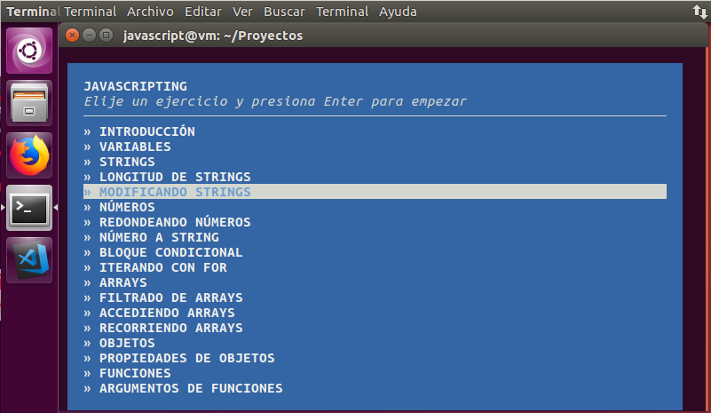

## Curso de <span style="color: #e49436">javascript</span>
### Introducción a javascript
#### <span style="color: #e49436">Javascripting</span>
#### <span style="color: #e49436">Dictado por:</span>
##### Prof. Erick Agrazal

---

Javascripting
-------------


---

Comenzemos por...
-----------------

```
CONTROL + ALT + T
```

Ó



--- 

El terminal
-----------



---

Ejecutamos <span style="color: #e49436">Javascripting</span>
------------------------------------------------------------



---

Resultado esperado
-----------------------------------------------

